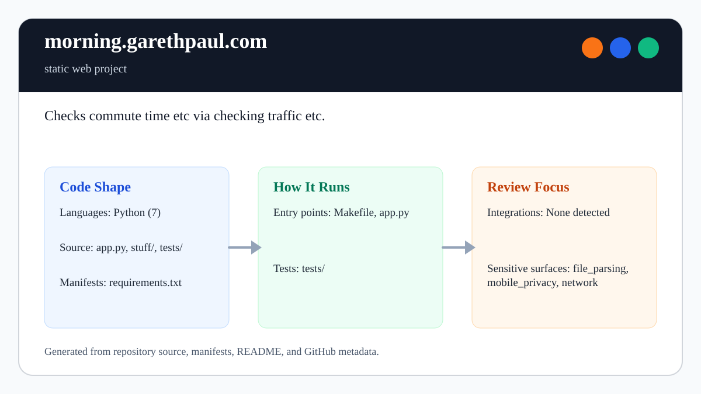

# morning.garethpaul.com

<!-- README-OVERVIEW-IMAGE -->


## Overview

`garethpaul/morning.garethpaul.com` is a static web project. Checks commute time etc via checking traffic etc.

This README is based on the checked-in source, manifests, scripts, and repository metadata on the `master` branch. The project language mix found during review was: Python (5).

## Repository Contents

- `README.md` - project overview and local usage notes
- `.gitignore` - local settings and Python artifact ignores
- `CHANGES.md` - recent maintenance changes
- `Makefile` - local static verification entry point
- `app.py`
- `SECURITY.md` - security reporting and disclosure guidance
- `scripts/check-baseline.py` - static commute dashboard baseline checks
- `static` - source or example code
- `stuff` - source or example code
- `templates` - source or example code
- `VISION.md` - project direction and maintenance guardrails

Additional scan context:

- Source directories: static, stuff, templates
- Dependency and build manifests: none detected
- Entry points or build surfaces: app.py
- Test-looking files: no obvious test files detected

## Getting Started

### Prerequisites

- Git
- Python 3 for `make check`
- Flask for live local runs

### Setup

```bash
git clone https://github.com/garethpaul/morning.garethpaul.com.git
cd morning.garethpaul.com
make check
cp settings.py.example settings.py
```

The setup commands above are derived from repository files. Legacy mobile, Python, or JavaScript samples may require older SDKs or package versions than a modern workstation uses by default.

## Running or Using the Project

- Copy `settings.py.example` to `settings.py` and fill in local values before making live TomTom requests.
- Run `python app.py` after installing Python dependencies.
- Set `FLASK_DEBUG=1` only for local debugging.

## Testing and Verification

- `make check` compiles the Python files and runs `scripts/check-baseline.py`.
- `scripts/check-baseline.py` verifies placeholder-safe settings behavior, debug opt-in, HTTPS route/template URLs, and documentation guardrails.

When the required SDK or runtime is unavailable, use static checks and source review first, then verify on a machine that has the matching platform toolchain.

## Configuration and Secrets

- Home/work coordinates, route API keys, personal commute details, `.env` files, and local settings overlays should stay out of git.
- `settings.py.example` in this repository is a placeholder template; real values belong in local-only `settings.py` or another ignored local configuration file.

## Security and Privacy Notes

- Review changes touching network requests, sockets, or service endpoints; examples from the scan include app.py, stuff/tomtom.py, templates/index.html.
- Keep TomTom requests on HTTPS and do not enable Flask debug mode in hosted deployments.
- Review changes touching file, media, JSON, XML, CSV, OCR, or data parsing; examples from the scan include stuff/tomtom.py.

## Maintenance Notes

- Run `make check` before pushing Python, settings, template, or security documentation changes.
- See `SECURITY.md` for vulnerability reporting and safe research guidance.
- See `VISION.md` for project direction and contribution guardrails.

## Contributing

Keep changes small and tied to the project that is already present in this repository. For code changes, document the toolchain used, avoid committing generated dependency directories or local configuration, and update this README when setup or verification steps change.
